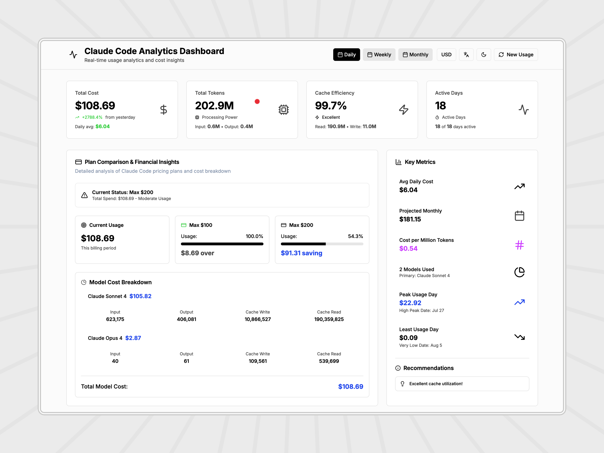
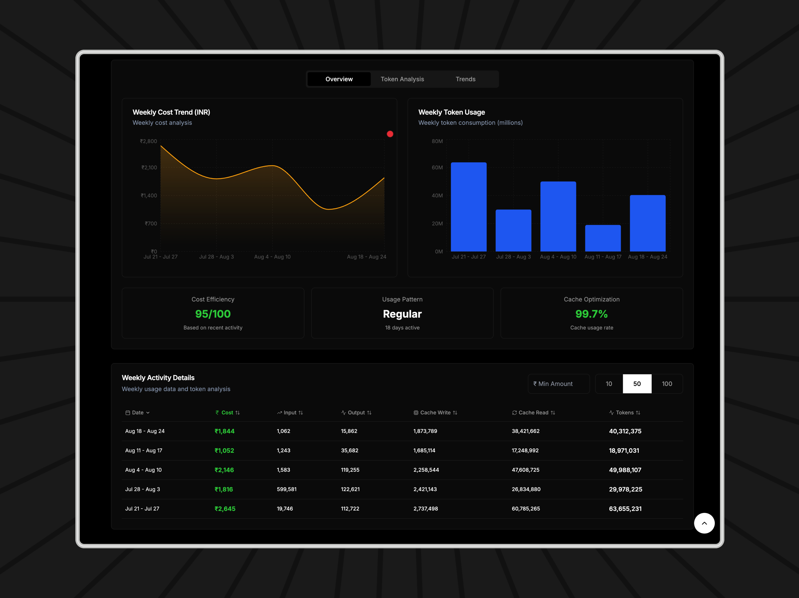
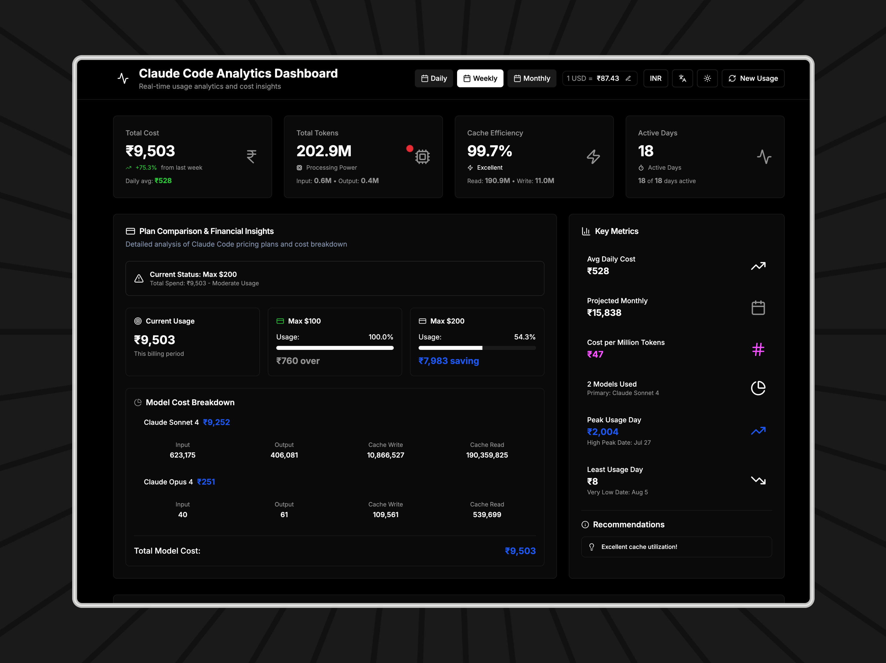

# Claude Code Analytics Dashboard

A comprehensive Next.js dashboard for monitoring Claude usage analytics, cost insights, and code statistics with real-time data visualization.


## 🚀 Features

- **Real-time Usage Analytics**: Monitor Claude usage patterns with live data updates
- **Cost Insights**: Track spending across different time periods (daily, weekly, monthly)
- **Multi-Currency Support**: View costs in USD and INR with real-time exchange rates
- **Interactive Charts**: Beautiful data visualizations using Recharts
- **Dark/Light Theme**: Toggle between dark and light modes
- **Internationalization**: Support for English and Hindi languages
- **Responsive Design**: Mobile-friendly interface built with Tailwind CSS
- **Docker Support**: Easy deployment with Docker and Docker Compose

## 📊 Dashboard Features

### Analytics Overview

- Total usage statistics
- Cost breakdown by time period
- Usage trends and patterns
- Real-time data refresh

### Visual Components

- Interactive bar charts
- Area charts for trend analysis
- Progress indicators
- Tabbed interface for different views

### Additional Features

- Currency conversion (USD/INR)
- Multi-language support (EN/HI)
- Theme switching
- Responsive design for all devices

## 📷 Screenshots

### Light Theme

<div align="center">
  
  <p><em>Main Dashboard - Light Theme</em></p>
  
  
  <p><em>Analytics View - Light Theme</em></p>
</div>

### Dark Theme

<div align="center">
  
  <p><em>Main Dashboard - Dark Theme</em></p>
  
  
  <p><em>Analytics View - Dark Theme</em></p>
</div>

## 🛠️ Tech Stack

- **Framework**: Next.js 15.3.3
- **Language**: TypeScript 5.8.3
- **UI Library**: React 19.1.0
- **Styling**: Tailwind CSS 3.4.17
- **Charts**: Recharts 2.15.3
- **Icons**: Lucide React 0.512.0
- **UI Components**: Radix UI
- **Deployment**: Docker & Docker Compose

## 📋 Prerequisites

- Node.js 18+ (recommended)
- npm or yarn
- Claude CLI (`ccusage` package)
- Docker (optional, for containerized deployment)

## 🚀 Quick Start

### Local Development

1. **Clone the repository**

   ```bash
   git clone https://github.com/tanu360/claude-code-dashboard.git
   cd claude-code-dashboard
   ```

2. **Install dependencies**

   ```bash
   npm install
   ```

3. **Run the development server**

   ```bash
   npm run dev
   ```

4. **Open your browser**
   Navigate to [http://localhost:3000](http://localhost:3000)

### Docker Deployment

1. **Using Docker Compose (Recommended)**

   ```bash
   docker-compose up -d
   ```

   The dashboard will be available at [http://localhost:3300](http://localhost:3300)

2. **Using Docker directly**
   ```bash
   docker build -t claude-dashboard .
   docker run -p 3000:3000 \
     -v ~/.claude/db:/home/nextjs/.claude/db:ro \
     claude-dashboard
   ```

### Production Build

```bash
npm run build
npm start
```

## 📁 Project Structure

```
claude-code-dashboard/
├── src/
│   ├── app/
│   │   ├── api/
│   │   │   ├── usage/          # Usage data API endpoint
│   │   │   └── exchange-rate/  # Currency exchange API
│   │   ├── globals.css         # Global styles
│   │   ├── layout.tsx          # Root layout
│   │   └── page.tsx            # Main dashboard page
│   ├── components/
│   │   ├── ui/                 # Reusable UI components
│   │   └── theme-provider.tsx  # Theme context
│   ├── lib/
│   │   └── utils.ts            # Utility functions
│   ├── locales/                # Internationalization
│   │   ├── en.ts               # English translations
│   │   ├── hi.ts               # Hindi translations
│   │   └── index.ts            # Locale exports
│   └── types/
│       └── usage.ts            # TypeScript type definitions
├── public/                     # Static assets
├── docker-compose.yml          # Docker Compose configuration
├── Dockerfile                  # Docker build configuration
└── package.json                # Dependencies and scripts
```

## 🔧 Configuration

### Environment Variables

The application uses the following environment variables:

- `NODE_ENV`: Set to `production` for production builds
- `HOME`: Home directory path (used in Docker)

### Claude CLI Setup

Make sure you have the Claude CLI installed and configured:

```bash
npm install -g ccusage@latest
```

The dashboard uses the `ccusage` command to fetch usage statistics.

## 📊 API Endpoints

### Usage Data

- **GET** `/api/usage` - Fetch Claude usage statistics

### Exchange Rate

- **GET** `/api/exchange-rate?date=YYYY-MM-DD` - Get USD to INR exchange rate

## 🎨 Customization

### Themes

The dashboard supports both light and dark themes. Theme switching is handled by the `ThemeProvider` component.

### Localization

Add new languages by creating translation files in the `src/locales/` directory and updating the locale index.

### Styling

Customize the appearance by modifying the Tailwind CSS configuration in `tailwind.config.js`.

## 🚀 Deployment

### Vercel (Recommended)

1. Fork this repository
2. Connect your GitHub account to Vercel
3. Import the project
4. Deploy automatically

### Other Platforms

The application can be deployed on any platform that supports Next.js:

- Netlify
- Railway
- Heroku
- DigitalOcean App Platform

## 🤝 Contributing

1. Fork the repository
2. Create a feature branch (`git checkout -b feature/amazing-feature`)
3. Commit your changes (`git commit -m 'Add some amazing feature'`)
4. Push to the branch (`git push origin feature/amazing-feature`)
5. Open a Pull Request

## 📝 Scripts

- `npm run dev` - Start development server
- `npm run build` - Build for production
- `npm run start` - Start production server
- `npm run lint` - Run ESLint

## 🐛 Issues

If you encounter any issues, please check the following:

1. Ensure Claude CLI (`ccusage`) is properly installed
2. Check that your Claude database is accessible
3. Verify Docker permissions (for Docker deployment)

For bug reports and feature requests, please [open an issue](https://github.com/tanu360/claude-code-dashboard/issues).

## 📄 License

This project is licensed under the MIT License - see the [LICENSE](LICENSE) file for details.

## 🙏 Acknowledgments

- [Next.js](https://nextjs.org/) for the amazing React framework
- [Tailwind CSS](https://tailwindcss.com/) for the utility-first CSS framework
- [Recharts](https://recharts.org/) for beautiful data visualizations
- [Radix UI](https://www.radix-ui.com/) for accessible UI components
- [Lucide](https://lucide.dev/) for the beautiful icons

## 📞 Support

For support, please reach out through:

- GitHub Issues: [Issues Page](https://github.com/tanu360/claude-code-dashboard/issues)
- Repository: [Claude Code Dashboard](https://github.com/tanu360/claude-code-dashboard)

---

Made with ❤️ using Next.js and TypeScript
